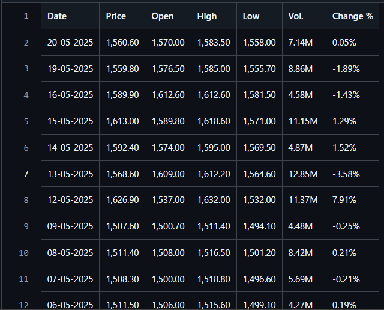
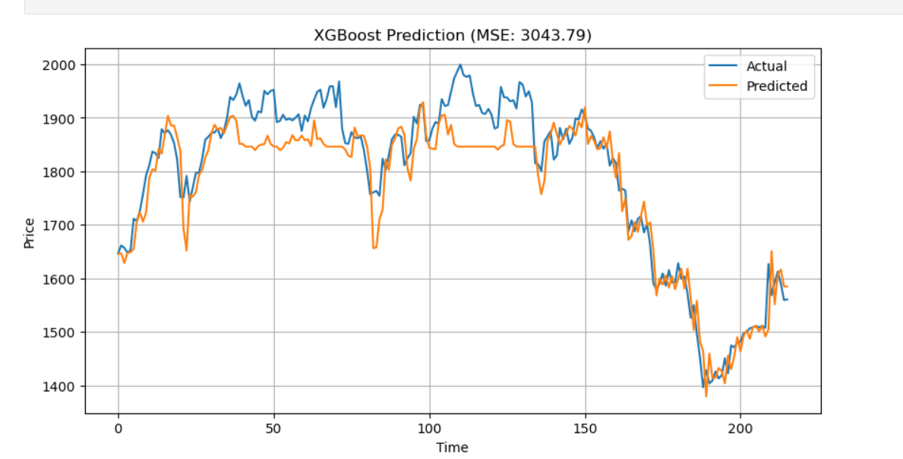
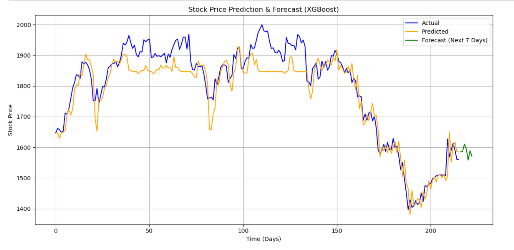
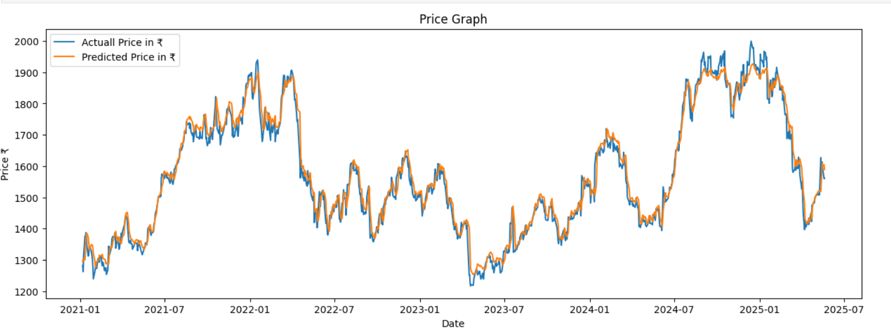
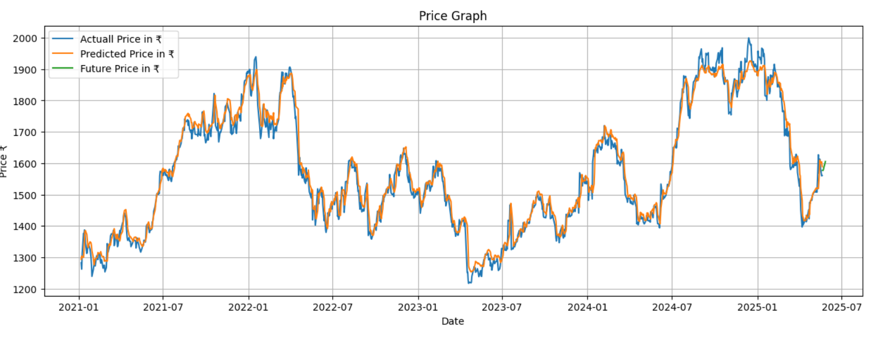

# 📈 Comparative Analysis of LSTM and XGBoost on Stock Price Prediction

This project performs a **comparative analysis of LSTM (Long Short-Term Memory) and XGBoost models** for **stock price prediction** using **real-world Infosys Ltd. historical data**.  
The objective is to evaluate how **machine learning** and **deep learning** approaches handle **financial time-series forecasting**.

---

## 🔍 Problem Statement

Stock price prediction is challenging due to:
- High volatility
- Non-linear trends
- Long-term dependencies in time-series data

This project aims to:
- Predict stock prices using historical data
- Compare XGBoost and LSTM models
- Identify the most effective approach for time-series forecasting

---

## 🚀 Key Highlights (Resume-Ready)

- Analyzed **~3 years of Infosys stock data**
- Implemented **XGBoost Regression** and **LSTM Neural Network**
- Achieved **R² score of 0.91 using LSTM**
- Evaluated model performance using **MSE and R²**
- Forecasted **next 7 trading days**
- Visualized **actual vs predicted prices**
- Conducted detailed comparison of both models

---

## 📁 Project Structure

Comparative-Analysis-of-LSTM-and-XGBoost-on-Stock-Price-Prediction/
│
├── INFY Historical Data (2).csv # Infosys stock dataset
├── XGBoost_OG.ipynb # XGBoost model notebook
├── LSTM_OG.ipynb # LSTM model notebook
├── README.md # Documentation

---

## 📊 Dataset Description

- **Company**: Infosys Ltd.
- **Data Type**: Historical stock price data
- **Duration**: ~3 years
- **Frequency**: Daily trading data
- **Total Records**: ~750–780 rows

### Features Used

| Feature | Description |
|-------|------------|
| Date | Trading date |
| Open | Opening price |
| High | Highest price |
| Low | Lowest price |
| Price | Closing price (Target) |
| Vol. | Trading volume |
| Change % | Daily price change |

---

## 🧠 Models Used

---

### 🔵 XGBoost (Extreme Gradient Boosting)

**Notebook:** `XGBoost_OG.ipynb`

**Why XGBoost?**
- Works well on structured data
- Fast training and inference
- Handles non-linear relationships

**Approach**
- Converted time-series data into supervised learning format
- Used lag-based features
- Evaluated using Mean Squared Error (MSE)

**Performance**
- MSE ≈ **3043**
- Good short-term trend capture
- Struggles with sudden price fluctuations

---

### 🟢 LSTM (Long Short-Term Memory)

**Notebook:** `LSTM_OG.ipynb`

**Why LSTM?**
- Designed for sequential/time-series data
- Captures long-term dependencies
- Handles volatility effectively

**Approach**
- Normalized data
- Created sliding window sequences (7 days)
- Evaluated using R² score and visual comparison

**Performance**
- **R² Score ≈ 0.91**
- Closely tracks actual stock prices
- More reliable for long-term forecasting

---

## 📉 Results & Visualization

### 🔹 Infosys Dataset Preview

### 🔹 XGBoost – Actual vs Predicted

### 🔹 XGBoost – Next 7 Days Forecast

### 🔹 LSTM – Actual vs Predicted

### 🔹 LSTM – Future Price Forecast

---

## ⚖️ Model Comparison

| Criteria | XGBoost | LSTM |
|--------|--------|------|
| Time dependency | ❌ Limited | ✅ Strong |
| Training speed | ✅ Fast | ❌ Slower |
| Volatility handling | ❌ Moderate | ✅ Excellent |
| Long-term forecasting | ❌ Weak | ✅ Strong |
| Accuracy | Good | Very High |

---

## 🏆 Conclusion

**LSTM outperforms XGBoost** for stock price prediction on the Infosys dataset.

- LSTM captures long-term dependencies effectively
- Produces more accurate predictions
- Better suited for financial time-series forecasting

XGBoost remains useful for:
- Short-term prediction
- Fast baseline modeling

---

## ✅ Advantages & Limitations

### 🔵 XGBoost
**Advantages**
- Fast training
- Simple interpretation
- Strong performance on tabular data

**Limitations**
- No inherent memory of past sequences
- Weak long-term forecasting ability

### 🟢 LSTM
**Advantages**
- Designed for time-series data
- Learns long-term patterns
- High predictive accuracy

**Limitations**
- Computationally expensive
- Requires more data and tuning

---

## 🛠️ Technologies Used

- Python
- Pandas, NumPy
- Matplotlib
- Scikit-learn
- XGBoost
- TensorFlow / Keras

---

## 👨‍💻 Author

**Matin Nadaf**  
B.Tech – Computer Science & Engineering  

---

⭐ *If you found this project useful, feel free to star the repository.*
